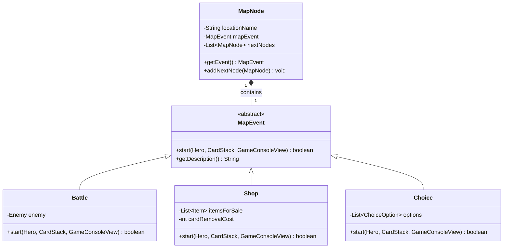

# Projeto MC322 - Roguelike Pokémon Deckbuilder

Este projeto foi desenvolvido como parte dos laboratórios da disciplina **MC322 - Programação Orientada a Objetos**.

O objetivo é implementar um jogo inspirado em **Slay the Spire** mas com temática **Pokémon**, no qual o jogador utiliza um **baralho de cartas** para derrotar inimigos em batalhas por turno.

O projeto foi desenvolvido em **Java** e executado via terminal.

# Estrutura do Projeto

O projeto segue a estrutura padrão criada pelo VSCode para projetos Java:

```text
.
├─ src/main/java
│  ├─ App.java
│  ├─ Hero.java
│  ├─ Enemy.java
│  ├─ Card.java
│  ├─ DamageCard.java
│  ├─ ShieldCard.java
│  └─ ...
├─ lib/
├─ bin/
└─ README.md
```

Onde:

- **src** — contém todos os arquivos `.java` do projeto  
- **lib** — pasta reservada para dependências externas (não utilizada neste projeto)  
- **bin** — arquivos `.class` gerados após a compilação  

# Como Executar o Projeto (com Gradle)

Apenas execute no terminal:

```bash
./ gradlew build
./ gradlew run
```

Isso iniciará o programa e o sistema de combate será executado no terminal.

# Como Jogar

Após compilar, o jogo se inicia mostrando uma tela com três opções de escolha para o personagem que te acompanhará em cada batalha.

```
Choose your pokemon! 

1: Charmander
2: Squirtle
3: Bulbasaur
Your choice:
```

Depois de escolher, uma tela com uma mensagem de aparição do adversário e as informações do jogador e do adversário, como vida, energia e escudo são mostradas (Obs.: o Inimigo não possui energia e seus ataques são premeditados a cada rodada):

```
A wild Pikachu has appeared!

-------------------------------------------
Charmander
HP: [████████████████████] 20/20 | Energy: 5 | Shield: 0
VS.
Pikachu
HP: [████████████████████] 20/20 | Shield: 0
-------------------------------------------
```

A cada rodada, o inimigo premedita seus ataques para tornar o jogo mais dinâmico e guiar a escolha do jogador:

```
Pikachu is powering up! (Damage: 5)
```
ou
```
Pikachu is raising their defense! (Shield: 3)
```
ou
```
Pikachu is getting stronger (Damage increase: 2)
```

Em seguida, o jogo começa com o turno do jogador e aparecerá um menu com as opções da rodada, as opções serão aleatórias, com 5 cartas puxadas da pilha de compra no início de cada rodada e descartadas para a pilha de descarte após seu uso, além da energia restante do jogador e um input com a escolha a ser feita:

```
Charmander, you're up! Choose your next move.
Energy remaining: 5/5
1: Use Harden (Cost: 1) - Grants 2 points of shield
2: Use Barrier (Cost: 2) - Grants 3 points of shield
3: Use Iron Defense (Cost: 5) - Grants 10 points of shield
4: Use Acid Armor (Cost: 4) - Grants 7 points of shield
5: Use Shell Armor (Cost: 3) - Grants 5 points of shield
6. End Round
Your choice:
```

As opções selecionadas mostrarão uma mensagem na tela que informa o que foi feito pelo jogador. A rodada termina apenas quando o jogador decidir encerrar a rodada, no caso acima, pela opção 6. (Obs.: Essa opção é sempre a última da lista, então se o jogador utilizar alguma carta, ela irá sumir da mão do jogador e ir para a pilha de descarte, fazendo com que a opção de encerrar turno vá para o índice 5 e assim por diante).

Exemplo de ataque do jogador com scratch:

```
>>> Charmander used Scratch!
```

Assim que a rodada do jogador termina, o inimigo fará seu movimento, podendo atacar ou se defender com valores de dano e defesa fixos, uma mensagem na tela mostrará se o inimigo atacou:

```
===========================================
It's the opponent's turn! Pikachu is choosing their move.
Pikachu attacks for 5 damage!
Charmander's health is now 15.
===========================================
```

Se defendeu:
```
===========================================
It's the opponent's turn! Pikachu is choosing their move.
Pikachu used the Shield!
Pikachu's shield is now 3.
===========================================
```

Ou aumentou seu dano:
```
===========================================
It's the opponent's turn! Pikachu is choosing their move.
Pikachu raised their damage!
Pikachu's attack is now 2.
===========================================
```

O jogo termina quando a vida do jogador ou do inimigo chegar a 0:

```
End of the game!
Pikachu triumphed over Charmander!
```
(Derrota do jogador)

```
Enemy fainted! Pikachu health is now 0

End of the game!
Charmander rises victorious defeating Pikachu!
```
(Vitória do jogador)

# Cartas
Cartas são o ponto chave de cada batalha, é com elas que o jogador faz as ações de cada rodada.

Cartas podem ser de ataque:
```
3: Use Flamethrower (Cost: 5) - Deals 8 points of damage
```
(Dá 8 pontos de dano no alvo)

De defesa:
```
1: Use Barrier (Cost: 2) - Grants 3 points of shield
```
(Dá 3 pontos de escudo para o usuário)

Ou de efeitos:
```
4: Use Light Ball (Cost: 5) - Increases 2 points of damage
```
(Aumenta o dano do usuário em 2 pontos)

# Efeitos
Efeitos são aplicados pelos personagens a cada rodada de acordo com a descrição da carta de efeito utilizada.

Os efeitos podem ser buffs (melhoram as habilidades de quem os usou. Ex.: Força) ou debuffs (prejudicam o alvo a que foi atingido. Ex.: Veneno)

Exemplo de Buff que aumenta o dano em 2 pontos (Força):

```
3: Use Light Ball (Cost: 5) - Increases 2 points of damage
```

Exemplo de Debuff que dá dano por rodada (Veneno):

```
2: Use Poison Jab (Cost: 3) - Triggers poison and causes 3 points of damage
```

A lista de efeitos aplicados é anotada abaixo da vida de cada personagem:

```
Pikachu
HP: [████████████████░░░░] 16/20 | Shield: 0
Active effects: 
Strength (2) Poison (3) 
```
Obs.: Ao lado de cada buff fica o quanto ele melhora o dano, Força é permanente até o fim da batalha. Ao lado de cada debuff fica o quanto de dano ele está dando, Veneno dá x pontos de dano e a cada rodada ele dá x - 1 pontos de dano, até que x - n seja igual a 0 (onde n é o número de rodadas).

# Progressão do mapa

Ao vencer uma batalha, o personagem escolherá entre duas batalhas com dois inimigos diferentes, até ele chegar na batalha final e poder vencer o jogo. Se ele perder durante qualquer uma das batalhas, ele é derrotado e não avança mais no mapa.

No fim de uma batalha vencida, o personagem pode ver o mapa e fazer sua escolha: 

```
===========================================
   MAP   
===========================================
Choose your next opponent:
1: Go to Rock Tunnel (Enemy: Geodude)
2: Go to Timeless Woods (Enemy: Snorlax)
Your path choice:
```

Todos os jogos tem um mapa definido nesse formato:

```
                            [Pikachu]
                             (Início)
                            /        \
                           /          \
                  [Geodude]            [Snorlax]
                      |                    |
                [Team Rocket]          [Pokerus]
                   /     \              /     \
                  /       \            /       \
                 /         +--[Shop]--+         \
                /             /    \             \
          [Clefable]   [Lapras]    [Flareon]   [Psyduck]
                \             \    /             /
                 \             \  /             /
                  +-------------++-------------+
                                |
                                V
                             [Mewtwo]
                           (Chefe Final)
```

# Recompensas e Loot (Pós-Batalha)
Ao vencer uma batalha, o jogador recebe **PokeCoins** e pode ter seus atributos máximos (Vida ou Energia) aumentados. Além disso, o jogador tem a oportunidade de melhorar seu baralho escolhendo uma entre 3 **cartas aleatórias** para adicionar à sua pilha de compras. Caso nenhuma carta seja do interesse do jogador, é possível pular (Skip) a recompensa.

```
>>> Rewards claimed: 30 Poke Coins and +2 Max Health!

=== BATTLE LOOT ===
Choose a new card to add to your deck:
1: Ember (Cost: 3) - Deals 5 points of damage
2: Protect (Cost: 3) - Grants 6 points of shield
3: Growl (Cost: 2) - Increases 1 point of damage
4: Skip reward
Your choice: 
```

# Sistemas de Progressão
Para tornar cada partida única e permitir que o jogador se fortaleça entre os combates, foram implementados dois sistemas de progressão integrados ao mapa:

### 1. Loja (Pokémon Mart)
Um evento especial no mapa representado pelo comerciante. Na Loja, o jogador pode gastar as **PokeCoins** obtidas em batalhas e eventos surpresa. As opções da loja incluem:
- **Comprar Itens (Poções):** O jogador pode adquirir itens consumíveis que vão para o seu inventário.
- **Remover Cartas:** O jogador pode pagar para remover uma carta do seu baralho, otimizando suas jogadas. O custo dessa remoção aumenta a cada uso, adicionando um fator estratégico na gestão do dinheiro.

```
=== Pokémon Mart ===
Welcome! Buy some potions to help your journey.
Your PokeCoins: 30

1: Buy Potion - 30 PokeCoins - Restores 5 HP
2: Buy Super Potion - 60 PokeCoins - Restores 10 HP
3: Buy Ether - 40 PokeCoins - Restores 3 Energy
4: Remove a random card from your deck - 50 PokeCoins
5: Leave Shop
Your choice: 
```

### 2. Poções (Itens Consumíveis e Inventário)
Durante a jornada e ao visitar a Loja, o herói pode adquirir Itens (como *Potion* ou *Ether*). Esses itens são armazenados em um **Inventário** próprio. 
Durante qualquer turno de uma batalha, o jogador tem a opção de abrir o inventário e consumir esses itens **sem gastar energia**. Eles oferecem efeitos instantâneos, como:
- **HealingItem:** Recupera pontos de vida (HP) do herói.
- **EnergyItem:** Restaura pontos de energia no turno atual, permitindo combos maiores de cartas.

```
=== Inventory ===
1: Use Potion - Restores 5 HP <-- Item de restauração
2. Back
Your choice: 
```

# Padrões de Projeto (Design Patterns)
Para manter o código escalável, organizado e focado na Orientação a Objetos, os seguintes Padrões de Projeto estruturais e comportamentais foram aplicados na implementação dos sistemas:

- **Observer (Observador):**
  - **Onde:** Utilizado no sistema de efeitos de status (classes que herdam de `Effect`, como `PoisonEffect`, `StrengthEffect` e `DexterityEffect`) e no gerenciamento do ciclo de vida das rodadas na classe `Battle`.
  - **Como:** A classe `Battle` atua como o Publicador (*Subject*), gerenciando uma lista de objetos que implementam a interface `Subscriber`. Quando uma fase específica do turno ocorre (como `BEGINNING_OF_ROUND` ou `END_OF_ROUND`, definidos pelo *enum* `GameEvent`), a Batalha dispara o método `launchesNotification()`. Os efeitos ativos, que atuam como Observadores (*Observers*), escutam essa notificação e executam sua lógica automaticamente no momento certo (por exemplo, o `PoisonEffect` causa dano no fim da rodada e até cancela sua própria inscrição usando `unsubscribe()` quando a duração zera).
  - **Fonte Consultada:** [Refactoring Guru - Observer](https://refactoring.guru/pt-br/design-patterns/observer)

- **Strategy (Estratégia):** 
  - **Onde:** Utilizado na navegação do mapa através da classe abstrata `MapEvent`.
  - **Como:** O contexto (`MapNode`) não precisa saber qual evento ele guarda. As classes `Battle`, `Shop` e `Choice` são Estratégias Concretas que sobrescrevem o método `start()`. O `Manager` simplesmente chama `currentEvent.start()`, e o polimorfismo garante a execução da lógica correta daquele nó.
  - **Fonte Consultada:** [Refactoring Guru - Strategy](https://refactoring.guru/pt-br/design-patterns/strategy)

- **Command (Comando):**
  - **Onde:** Utilizado no sistema de eventos de escolha (`Choice`) e nas cartas de efeito (`EffectCard`).
  - **Como:** As consequências de uma escolha narrativa (como perder moedas ou tomar dano) são encapsuladas na interface funcional `ChoiceAction`. A classe `ChoiceOption` armazena o comando e o aciona via `.apply()`. Isso permite criar infinitos eventos customizados sem precisar de subclasses extensas.
  - **Fonte Consultada:** [Refactoring Guru - Command](https://refactoring.guru/pt-br/design-patterns/command)

# Diagrama de Classes UML (Arquitetura do Mapa e Eventos)
O diagrama abaixo ilustra a aplicação do padrão **Strategy**, mostrando como as batalhas, as lojas e as escolhas se integram ao fluxo de nós do mapa de forma polimórfica.


# Tecnologias Utilizadas

- Java 25
- Gradle
- Visual Studio Code
- Git e GitHub
- JUnit
- Mermaid

# Autores

Projeto desenvolvido por:

- Isabella Favaron Rover, RA281248
- Vinícius Cappelli d'Avila, RA185507